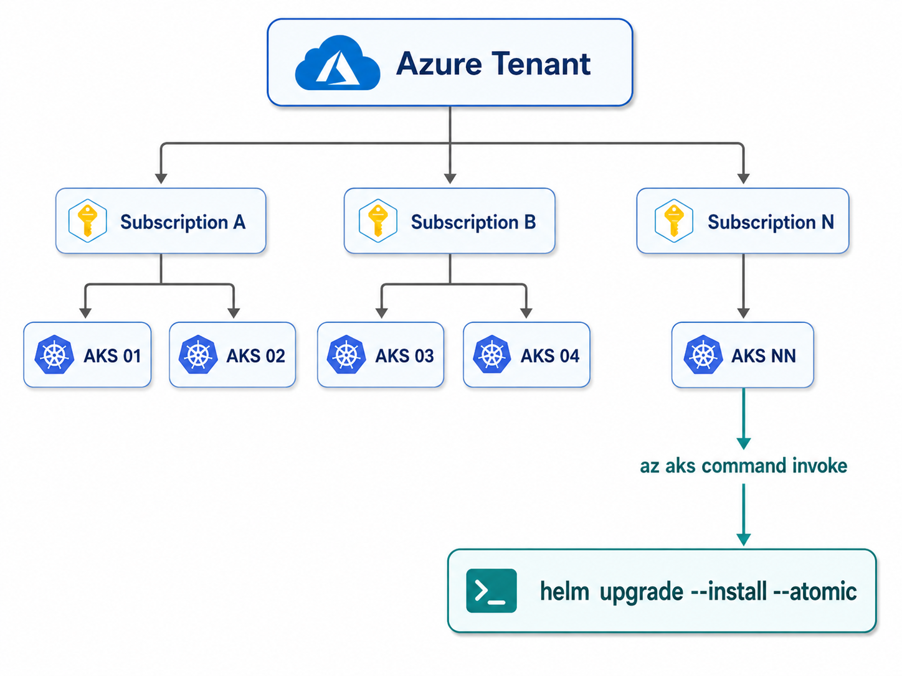
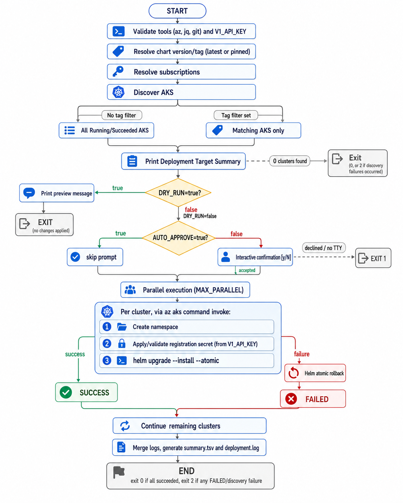

# Trend Vision One Container Security — Mass AKS Deployment

Automation to deploy or upgrade **Trend Vision One Container Security** at scale across **Azure Kubernetes Service (AKS)** clusters distributed across one or multiple Azure subscriptions.

The solution uses:
- Multi-subscription discovery.
- `az aks list` to discover AKS clusters.
- Optional Azure tag filtering (AND logic).
- **Dry-run mode**: preview the full target list before anything is applied.
- **Interactive confirmation gate** before deploying (skippable via `AUTO_APPROVE`).
- Automatic resolution of the latest stable Container Security Helm chart tag (or a pinned version).
- `az aks command invoke` to execute commands inside each cluster without requiring `az aks get-credentials`.
- Automatic creation of the Vision One registration secret from an API key.
- Auto-generated `overrides.yaml` per cluster, built from environment toggles.
- `helm upgrade --install --atomic` to install or upgrade Container Security with automatic rollback on failure.
- Configurable parallel execution.
- Per-cluster timing and a single consolidated deployment log at the end.
- Final SUCCESS / FAILED summary and a `summary.tsv` report.

---

## Architecture



Container Security is installed **once per cluster**, not once per node.

Components that require presence on each worker node are managed by Kubernetes through `DaemonSet`. Therefore, when AKS scales out, new nodes automatically receive the corresponding components.

---

# Project Layout

```text
AKS-RunCommand/
├── README.md
└── Scripts/
    └── deploy-cs-aks.sh
```

No local `overrides.yaml` or registration secret file is required. Both are generated automatically by the script for every cluster (see [Auto-Generated Overrides](#auto-generated-overrides) and [Vision One Registration Key](#vision-one-registration-key) below).

---

# Requirements

The machine running the script must have:

```text
Bash
Azure CLI (az)
jq
git
```

Validate:

```bash
az version
bash --version
jq --version
git --version
```

Authenticate to Azure:

```bash
az login
```

The identity used must have permissions to:

- List subscriptions.
- List AKS clusters.
- Execute `az aks command invoke` on target clusters.

`git` is used to resolve the Container Security Helm chart version/tag from the public chart repository and does not require authentication.

---

# Vision One Registration Key

The script registers every cluster automatically using a Vision One API key with permission to:

```text
Automatically register cluster
```

Export it before running the script:

```bash
export V1_API_KEY="<VISION_ONE_API_KEY>"
```

The script fails fast if `V1_API_KEY` is not set. For every target cluster it:

1. Creates the namespace (`$NAMESPACE`) if it does not already exist.
2. Creates/updates the Kubernetes secret `trendmicro-container-security-registration-key` in that namespace from `V1_API_KEY` (idempotent, via `kubectl apply`).
3. Validates the secret exists before continuing with the Helm install.

There is no manual YAML secret file to create or maintain.

> Do not store the Registration Key in a public repository. Inject it as a protected pipeline variable or from a secret manager (Azure Key Vault, GitHub Actions Secrets, Azure DevOps Variable Groups, etc.).

---

# Auto-Generated Overrides

For each cluster, the script builds a temporary `overrides.yaml` on the fly (via `mktemp`), applies it with `helm --values`, and deletes it right after that cluster's deployment finishes. There is no persistent overrides file to edit per cluster.

The generated file includes:

```yaml
visionOne:
    endpoint: https://api.xdr.trendmicro.com/external/v2/direct/vcs/external/vcs
    exclusion:
        namespaces: [kube-system, <NAMESPACE>]
    runtimeSecurity:
        enabled: <RUNTIME_SECURITY_ENABLED>
    vulnerabilityScanning:
        enabled: <VULNERABILITY_SCAN_ENABLED>
    malwareScanning:
        enabled: <MALWARE_SCAN_ENABLED>
    secretScanning:
        enabled: <SECRET_SCAN_ENABLED>
    fileIntegrityMonitoring:
        enabled: <FIM_ENABLED>
    scanManager:
        maxJobCount: <MAX_JOB_COUNT>
    resources:
        falco:
            limits: { cpu: <CPU_LIMIT>, memory: <MEMORY_LIMIT> }
            requests: { cpu: <CPU_REQUEST>, memory: <MEMORY_REQUEST> }
        scout:
            limits: { cpu: <CPU_LIMIT>, memory: <MEMORY_LIMIT> }
            requests: { cpu: <CPU_REQUEST>, memory: <MEMORY_REQUEST> }
    tolerations:
        defaults:
            - { effect: NoSchedule, key: nvidia.com/gpu, operator: Exists }
            - { effect: NoExecute, key: node.kubernetes.io/not-ready, operator: Exists }
    images:
        defaults:
            registry: <IMAGE_REGISTRY>
            project: <IMAGE_PROJECT>
            tag: <RESOLVED_VERSION>
            pullPolicy: IfNotPresent
```

- The five scanning/feature toggles and the image registry/project are controlled via environment variables (see [Variables](#variables)).
- `CPU_LIMIT`, `CPU_REQUEST`, `MEMORY_LIMIT`, `MEMORY_REQUEST`, and `MAX_JOB_COUNT` are currently **hardcoded constants** at the top of the script (`200m` / `100m` / `512Mi` / `256Mi` / `3`). Edit the script directly if these minimums need to change for your environment.
- Default tolerations for GPU pools and not-ready nodes are always included so the DaemonSets can schedule on those node pools without extra configuration.

---

# Variables

## Required

```bash
V1_API_KEY="<VISION_ONE_API_KEY>"
```

Exported before running the script (see [Vision One Registration Key](#vision-one-registration-key)).

---

## Optional Variables

The script uses sane defaults when a variable is not set:

```bash
GITHUB_REPO="${GITHUB_REPO:-trendmicro/visionone-container-security-helm}"
TARGET_VERSION="${TARGET_VERSION:-latest}"
NAMESPACE="${NAMESPACE:-trendmicro-system}"
RELEASE="${RELEASE:-trendmicro}"
TIMEOUT="${TIMEOUT:-10m}"
MAX_PARALLEL="${MAX_PARALLEL:-4}"
GROUP_ID="${GROUP_ID:-00000000-0000-0000-0000-000000000002}"
IMAGE_REGISTRY="${IMAGE_REGISTRY:-public.ecr.aws}"
IMAGE_PROJECT="${IMAGE_PROJECT:-trendmicro/container-security}"
RUNTIME_SECURITY_ENABLED="${RUNTIME_SECURITY_ENABLED:-true}"
VULNERABILITY_SCAN_ENABLED="${VULNERABILITY_SCAN_ENABLED:-true}"
MALWARE_SCAN_ENABLED="${MALWARE_SCAN_ENABLED:-false}"
SECRET_SCAN_ENABLED="${SECRET_SCAN_ENABLED:-false}"
FIM_ENABLED="${FIM_ENABLED:-false}"
CHART_URL="${CHART_URL:-}"
SUBSCRIPTIONS="${SUBSCRIPTIONS:-}"
AKS_TAG_FILTER="${AKS_TAG_FILTER:-}"
DRY_RUN="${DRY_RUN:-false}"
AUTO_APPROVE="${AUTO_APPROVE:-false}"
RUN_DIR="${RUN_DIR:-./trend-aks-run-<timestamp>}"
```

`CHART_URL` only needs to be set to override the chart location entirely; otherwise it is derived automatically from `GITHUB_REPO` and the resolved version tag.

`GROUP_ID` no longer needs to be supplied manually — it already defaults to a working Vision One group ID. There is no `POLICY_ID` variable in this version of the script.

---

# TARGET_VERSION

Defines the Container Security Helm chart version to install.

Default:

```bash
TARGET_VERSION="latest"
```

## Latest Stable (default)

When `TARGET_VERSION=latest`, the script queries the chart repository's tags with `git ls-remote --tags` and picks the highest stable `MAJOR.MINOR.PATCH` semantic-version tag automatically. No pre-release/non-numeric tags are considered.

## Pinned Version

```bash
export TARGET_VERSION="3.5.1"
```

The script accepts the version with or without a leading `v` and resolves it against the actual tag in the repository (`3.5.1`, `v3.5.1`, etc., whichever exists).

The resolved chart is retrieved from:

```text
https://github.com/<GITHUB_REPO>/archive/refs/tags/<RESOLVED_TAG>.tar.gz
```

---

# SUBSCRIPTIONS

Controls which subscriptions are included in the automation.

## Current Subscription

If not configured:

```bash
unset SUBSCRIPTIONS
```

the script uses the subscription currently selected in Azure CLI.

---

## Single Subscription

```bash
export SUBSCRIPTIONS="xxxxxxxx-xxxx-xxxx-xxxx-xxxxxxxxxxxx"
```

---

## Multiple Subscriptions

Separate IDs with commas:

```bash
export SUBSCRIPTIONS="sub-id-01,sub-id-02,sub-id-03"
```

---

## All Accessible Subscriptions

```bash
export SUBSCRIPTIONS="all"
```

In this mode, the script uses:

```bash
az account list
```

and processes all `Enabled` subscriptions visible to the current identity.

---

# Tag Filtering

Tag filtering is optional.

If `AKS_TAG_FILTER` is empty, all AKS clusters matching the following state are processed:

```text
powerState.code == Running
provisioningState == Succeeded
```

---

## Single Tag

```bash
export AKS_TAG_FILTER="Environment=Prod"
```

---

## Multiple Tags

```bash
export AKS_TAG_FILTER="Environment=Prod,TrendSecurity=Enabled"
```

Filters use **AND** logic. Tag keys are matched case-insensitively; tag values are matched exactly (case-sensitive).

Example:

```text
AKS01
Environment=Prod
TrendSecurity=Enabled
=> SELECTED

AKS02
Environment=Prod
TrendSecurity=Disabled
=> SKIPPED

AKS03
Environment=Dev
TrendSecurity=Enabled
=> SKIPPED
```

---

## Recommended Tag for Controlled Rollout

```bash
export AKS_TAG_FILTER="TrendMicroContainerSecurity=Enabled"
```

This makes the tag act as an opt-in mechanism.

---

# Cluster Name Normalization

Vision One may require a different format than the original AKS name. The script automatically replaces unsupported characters with `_`.

```text
Azure:      aks-prod-br-01
Vision One: aks_prod_br_01
```

The original AKS name is still used for all Azure operations. Only `visionOne.clusterName` uses the normalized name.

---

# Resource ID

The Azure Resource ID is retrieved automatically from `az aks list` and passed as-is:

```text
/subscriptions/<SUBSCRIPTION_ID>/resourceGroups/<RG>/providers/Microsoft.ContainerService/managedClusters/<AKS_NAME>
```

```bash
--set-string visionOne.resourceId="$aks_id"
```

Do not modify or normalize the Resource ID.

---

# Installation and Upgrade

The script uses `helm upgrade --install`, so the same command handles both installation and upgrade scenarios depending on whether the release already exists.

```bash
helm upgrade --install \
  "$RELEASE" \
  "$CHART_URL" \
  --namespace "$NAMESPACE" \
  --values "$OVERRIDES_FILE" \
  --set visionOne.clusterRegistrationKey=true \
  --set-string visionOne.groupId="$GROUP_ID" \
  --set-string visionOne.clusterName="$trend_cluster_name" \
  --set-string visionOne.resourceId="$aks_id" \
  --atomic \
  --timeout "$TIMEOUT"
```

`$OVERRIDES_FILE` here refers to the temporary, auto-generated file described in [Auto-Generated Overrides](#auto-generated-overrides), not a file the user needs to provide.

---

# Atomic Rollback

The `--atomic` flag makes Helm automatically roll back the release if the deployment fails, and makes the command wait for release resources before considering the operation successful.

```text
helm upgrade --install --atomic
     |
     +-- SUCCESS
     |
     +-- FAILURE
             |
             v
          ROLLBACK
```

---

# Remote Execution with AKS Run Command

To avoid managing Kubernetes credentials cluster by cluster, the script uses `az aks command invoke` to run `kubectl` and `helm` in the context of each cluster, avoiding an `az aks get-credentials` call per cluster.

---

# Parallel Execution

The maximum number of clusters processed simultaneously is controlled by:

```bash
MAX_PARALLEL="${MAX_PARALLEL:-4}"
```

```bash
export MAX_PARALLEL=8
```

```text
AKS01 ------------------+
AKS02 ------------------|
AKS03 ------------------|  running simultaneously
AKS04 ------------------+

AKS02 completes
       |
       v
AKS05 starts
```

It is recommended to start with `MAX_PARALLEL=4` and increase gradually if required.

---

# Dry Run & Confirmation Gate

Before applying anything, the script always discovers subscriptions and clusters and prints a **Deployment Target Summary** table.

## Dry Run

```bash
export DRY_RUN=true
```

With `DRY_RUN=true`, the script stops right after printing the target summary — no namespace, secret, or Helm changes are made, and no confirmation prompt is shown.

## Confirmation Prompt

When `DRY_RUN=false` (default) and there is at least one target cluster, the script pauses and asks:

```text
Proceed with deployment to <N> cluster(s) across <M> subscription(s)? [y/N]
```

## Skipping the Prompt (CI/CD)

```bash
export AUTO_APPROVE=true
```

`AUTO_APPROVE=true` skips the interactive prompt and deploys immediately after discovery. It is required for non-interactive/CI runs, since the script exits with an error if no TTY is available and confirmation is still required. `AUTO_APPROVE` is ignored when `DRY_RUN=true`.

---

# Run Directory & Logs

Each execution creates its own run directory:

```bash
RUN_DIR="${RUN_DIR:-./trend-aks-run-<timestamp>}"
```

```text
trend-aks-run-20260830-185500/
├── deployment.log   # single consolidated log for all clusters in this run
└── summary.tsv      # machine-readable summary
```

Per-cluster logs and result files are written to temporary folders (`.tmp-logs`, `.tmp-results`) during the run, then merged into the single `deployment.log` and removed once the run finishes. There are no separate persisted per-cluster log files after completion — search `deployment.log` for a cluster's name/section to find its output.

Each cluster's section in `deployment.log` records its start time, end time, and duration:

```text
[2026-08-30 18:55:21] [START]   aks-prod-01 | Subscription: sub-prod
[2026-08-30 18:57:04] [SUCCESS] aks-prod-01 | 01m:43s
```

The total execution time is included in the final summary block at the end of `deployment.log`.

---

# Final Summary

At the end, the script prints (and appends to `deployment.log`) a summary similar to:

```text
================================================================================
 FINAL DEPLOYMENT SUMMARY
================================================================================
Subscriptions       : 3
Clusters             : 27
Successful           : 25
Failed               : 2
Discovery Failures   : 0
Total Time           : 18m:42s
================================================================================
```

It also generates `summary.tsv` with the columns:

```text
Index
SubscriptionId
Subscription
ResourceGroup
Cluster
TrendCluster
Status
Seconds
StartEpoch
EndEpoch
```

---

# Execution Examples

All examples assume the current directory is `Full AKS Deployment/`. Adjust the path to `Scripts/deploy-cs-aks.sh` if running from elsewhere.

## Preview Only (Dry Run)

```bash
export V1_API_KEY="xxxx"
export SUBSCRIPTIONS="all"

DRY_RUN=true ./Scripts/deploy-cs-aks.sh
```

---

## All AKS Clusters in the Current Subscription

```bash
export V1_API_KEY="xxxx"

./Scripts/deploy-cs-aks.sh
```

---

## Multiple Subscriptions

```bash
export V1_API_KEY="xxxx"
export SUBSCRIPTIONS="sub-id-01,sub-id-02,sub-id-03"

./Scripts/deploy-cs-aks.sh
```

---

## All Accessible Subscriptions, Non-Interactive (CI/CD)

```bash
export V1_API_KEY="xxxx"
export SUBSCRIPTIONS="all"
export AUTO_APPROVE=true

./Scripts/deploy-cs-aks.sh
```

---

## Production Clusters Only

```bash
export V1_API_KEY="xxxx"
export SUBSCRIPTIONS="all"
export AKS_TAG_FILTER="Environment=Prod"

./Scripts/deploy-cs-aks.sh
```

---

## Only Clusters Opted-In for Trend

```bash
export V1_API_KEY="xxxx"
export SUBSCRIPTIONS="all"
export AKS_TAG_FILTER="TrendMicroContainerSecurity=Enabled"

./Scripts/deploy-cs-aks.sh
```

---

## Run 8 Clusters in Parallel

```bash
export V1_API_KEY="xxxx"
export SUBSCRIPTIONS="all"
export MAX_PARALLEL=8

./Scripts/deploy-cs-aks.sh
```

---

## Pin Version and Increase Timeout

```bash
export V1_API_KEY="xxxx"
export TARGET_VERSION="3.5.1"
export TIMEOUT="15m"

./Scripts/deploy-cs-aks.sh
```

---

# Full Example

```bash
V1_API_KEY="xxxx" \
SUBSCRIPTIONS="all" \
AKS_TAG_FILTER="TrendMicroContainerSecurity=Enabled" \
MAX_PARALLEL=4 \
TARGET_VERSION="latest" \
AUTO_APPROVE=true \
./Scripts/deploy-cs-aks.sh
```

---

# Execution Flow



---

# AKS Scale-Out

You do not need to run this automation again when a cluster only adds new nodes.

Container Security is installed at the cluster level. Node-level components managed through DaemonSet are automatically scheduled by Kubernetes when new nodes appear.

```text
AKS
 |
 +-- Node 1 -> Trend components
 +-- Node 2 -> Trend components
 +-- Node 3 -> Trend components
 |
 +-- Cluster Autoscaler
        |
        v
      Node 4
        |
        v
   DaemonSet scheduling
        |
        v
   Trend components
```

---

# Node Pool Considerations

The auto-generated overrides already include default tolerations for:

```text
nvidia.com/gpu       (NoSchedule)
node.kubernetes.io/not-ready (NoExecute)
```

For clusters with additional taints, node selectors, dedicated/system pools, or other special restrictions, verify whether the Trend `DaemonSets` need further scheduling configuration. Since the overrides file is generated per run rather than hand-edited, additional tolerations or node selectors currently need to be added directly in the script's overrides template (`deploy-cs-aks.sh`).

---

# Security

## Registration Key

Do not store the real `V1_API_KEY` in a public Git repository or in shell history on a shared host.

Recommended options:

- Azure Key Vault.
- GitHub Actions Secrets.
- Azure DevOps Variable Groups.
- Enterprise secret managers.

---

## Azure Permissions

Apply least privilege to the identity used for rollout. It must be able to:

```text
List subscriptions
List AKS
Run AKS command invoke
```

Avoid overly broad roles when possible.

---

# Exit Codes

```text
0 = Run completed with no failures (includes: dry-run preview, or no matching clusters found and no discovery failures)
1 = Validation/setup error (missing tool, missing V1_API_KEY, invalid variable, Azure CLI not authenticated,
    deployment declined at the confirmation prompt, or no interactive terminal available to confirm)
2 = One or more clusters failed to deploy, and/or one or more subscriptions failed discovery
```

This simplifies CI/CD integration.

---

# CI/CD Usage

The automation can be executed from:

- Azure Automation
- Cloud Shell
- Bastion / administration hosts

Inject as protected pipeline variables/secrets:

```text
V1_API_KEY        (secret)
SUBSCRIPTIONS
AKS_TAG_FILTER
MAX_PARALLEL
TARGET_VERSION
AUTO_APPROVE       (set to true for non-interactive runs)
DRY_RUN            (set to true for a preview-only pipeline stage)
```

---

# Recommended Rollout Strategy

For large environments, use a tag such as:

```text
TrendMicroContainerSecurity=Enabled
```

run with `DRY_RUN=true` first to validate the target list, and onboard clusters progressively.

```text
Wave 1
  5 clusters

Wave 2
  20 clusters

Wave 3
  Remaining clusters
```

Start with `MAX_PARALLEL=4` and increase concurrency only after validating stability.

---

# Future Operations

This script addresses:

```text
Existing AKS clusters
      |
      v
Mass installation / upgrade
```

If the future objective is to automatically protect every new AKS cluster at creation time, consider evolving the design toward GitOps / IaC, for example:

```text
Azure Policy
     |
     v
Flux / GitOps
     |
     v
Helm deployment
     |
     v
Trend Container Security
```

The current script can still be used for:

- Mass bootstrap.
- Remediation.
- Mass upgrade.
- Operational auditing (via `DRY_RUN=true`).
- Tag-controlled rollout.

---

# Troubleshooting

## Find a Cluster's Output

There is no separate log file per cluster after the run completes; search the consolidated log instead:

```bash
grep -n "Azure Cluster    : <aks-name>" trend-aks-run-*/deployment.log
```

Then read the surrounding block for that cluster's full output and result.

---

## Validate Helm Release

```bash
helm status trendmicro \
  --namespace trendmicro-system
```

---

## View Pods

```bash
kubectl get pods \
  --namespace trendmicro-system \
  -o wide
```

---

## View DaemonSets

```bash
kubectl get daemonsets \
  --namespace trendmicro-system
```

---

## Cluster Not Selected

Validate tags:

```bash
az aks show \
  --resource-group <RG> \
  --name <AKS> \
  --query tags
```

Compare with:

```bash
echo "$AKS_TAG_FILTER"
```

---

## Cluster Is Not Running

The automation only processes clusters with:

```text
PowerState = Running
ProvisioningState = Succeeded
```

---

## Script Exits Asking to Confirm in CI

CI/CD pipelines usually have no interactive TTY. Set `AUTO_APPROVE=true` for non-interactive runs, or `DRY_RUN=true` for a preview-only stage.

---

## One Cluster Fails but the Others Continue

This behavior is intentional. Each cluster is processed independently and recorded as `SUCCESS` or `FAILED`. The final summary identifies clusters that require remediation.

---

# Disclaimer

Before performing a mass rollout in production:

1. Run with `DRY_RUN=true` first to confirm the target list.
2. Validate the target chart version (`TARGET_VERSION`).
3. Test first in non-production clusters.
4. Confirm outbound connectivity to Trend Vision One.
5. Validate taints and tolerations across node pools.
6. Validate Azure permissions.
7. Use a conservative `MAX_PARALLEL` value.
8. Review `deployment.log` and `summary.tsv` before expanding the rollout.